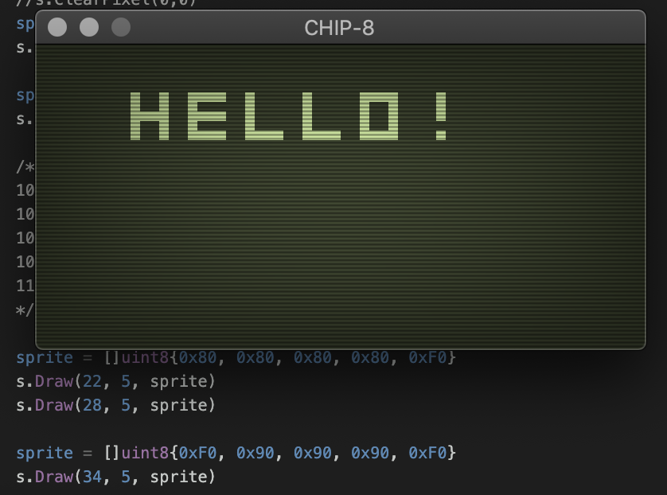
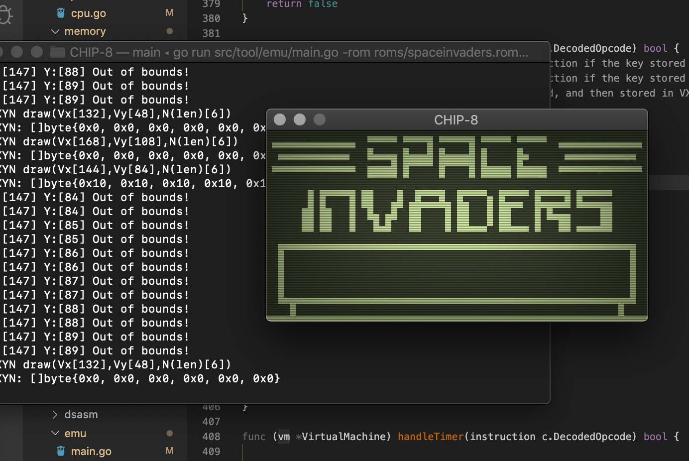
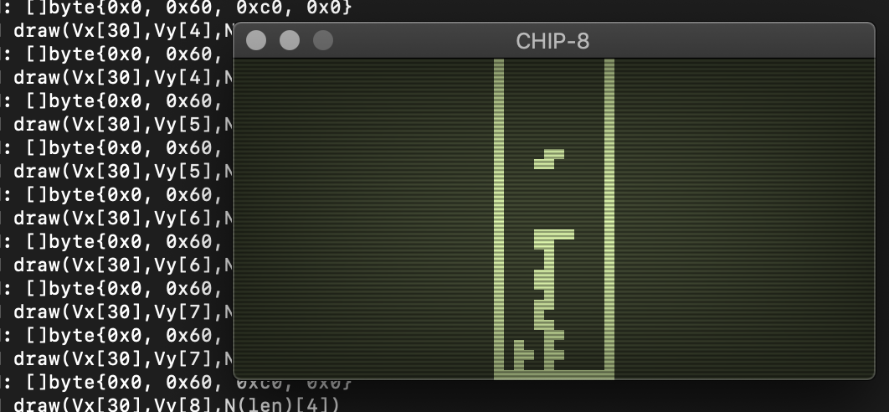

# CHIPPY



This is a proof of concept CHIP-8 emulator that was written to support a
technical artical on my blog. The code is proof-of-concept quality code
but it should be sufficient if you want to understand the emaultor
implementation.

_NOTE_ : I did not add sound emulation support. The outline of the code is 
there, but I could not find a good x-platform sound library with golang 
bindings.

Due to rather extreme time contraints, I have only tested this on mac.

## Running the emulator

Clone the repo, and run the following:

```   
$ mkdir bin vendor
$ export GOPATH=$(pwd)/vendor
$ go get -d ./...

# Now add your local src pkg path, dont add this before syncing libs
$ export GOPATH=$(pwd)/vendor:$(pwd)
$ go run src/tool/emu/main.go -rom games/roms/SNEK.ch8

# Or to build 
$ go build -o bin/emu src/tool/emu/main.go
...
...
...

# To disassemble :
$ go run src/tool/dsasm/main.go -rom games/roms/SNEK.ch8

```
## Screenshots






## Supporting Libraries : Sound && Graphics   

Graphics (OpenGL go bindings + GLSL Shaders)  
https://github.com/faiface/glhf

Audio   
https://github.com/go-audio/generator

## Other ROMs 

https://github.com/badlogic/chip8/tree/master/roms


## References      

https://en.wikipedia.org/wiki/CHIP-8   

http://www.multigesture.net/articles/how-to-write-an-emulator-chip-8-interpreter/     

https://en.wikipedia.org/wiki/CHIP-8#Virtual_machine_description     

http://www.emulator101.com/chip-8-instruction-set.html   

http://devernay.free.fr/hacks/chip8/C8TECH10.HTM    

http://www.multigesture.net/wp-content/uploads/mirror/goldroad/chip8.shtml    

http://mattmik.com/files/chip8/mastering/chip8.html    
